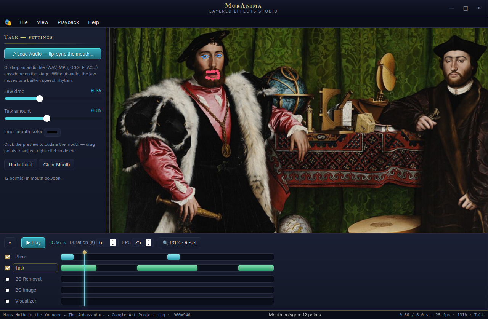
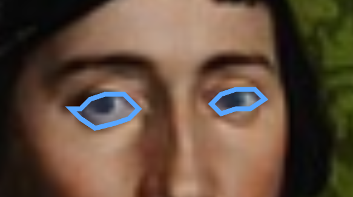
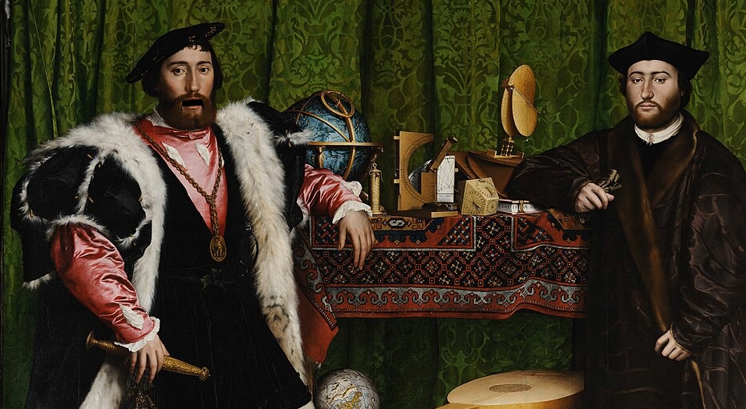
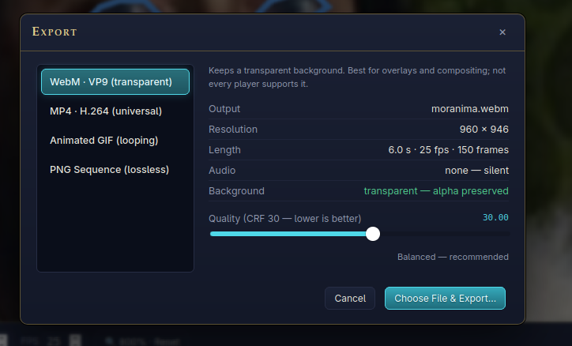

# MorAnima

Bring a still character image to life. MorAnima is a desktop app that layers animation effects — blinking, audio-driven lip-sync, background motion, and ambient particle FX — on top of a single PNG, then exports the result as video, GIF, or a Kdenlive-ready PNG frame sequence.

Trace your character's eyes and mouth once with a few clicks; MorAnima does the rest with pure pixel warping. No rigging, no sprite sheets, no per-frame drawing.

**[▶ Try the web version](https://moribundmurdoch.github.io/MorAnima/)** — the same effects ported to canvas + WebAudio, running entirely in your browser ([source](docs/index.html)). The desktop app remains the full studio: the web version exports WebM only (no MP4/GIF/PNG-sequence), and skips the perspective-tilt background motion.



| Trace eyes with a few clicks | An exported frame, jaw mid-drop |
| :---: | :---: |
|  |  |

## Features

- **Blink** — trace each eye as a polygon and get natural liquify-style blinks: lids descend with stretched skin, a soft lash shadow, and feathered edges. Blinks are randomly scheduled and deterministic, so exports match the preview exactly.
- **Talk** — trace the mouth and the jaw drops in sync with either:
  - a built-in synthetic speech rhythm, or
  - **real audio lip-sync**: load any audio file and a bandpass + RMS envelope (with sensitivity, noise gate, and smoothing controls) drives the mouth. The audio is muxed into the export.
- **Background removal** — one click detects the border colors of your image and makes them transparent, so flat-background renders become clean overlays.
- **Background image & camera motion** — drop in a backdrop and give it a gentle zoom, drift, sway, or perspective tilt.
- **Visualizers & particles** — animated bars, waves, starfield backdrops, or firefly / snow / ember overlays composited around your character.
- **Export formats**
  - WebM (VP9) with transparency preserved — perfect for compositing
  - MP4 (H.264) — plays everywhere
  - Looping animated GIF
  - Lossless PNG sequence for import into Kdenlive or any NLE

  

All effects preview live in the app with playback, a timeline, click-to-seek, zoom/pan, and keyboard shortcuts (press `F1` in-app for the full list).

## Requirements

- [Rust](https://rustup.rs/) (2021 edition)
- [ffmpeg](https://ffmpeg.org/) on your `PATH` — used for audio decoding and video export. Without it you can still preview and export PNG sequences.
- Linux / macOS / Windows (built on [Dioxus](https://dioxuslabs.com/) desktop)

## Build & run

```sh
cargo run --release
```

## Usage

1. **Open** a character image (`Ctrl+O`). Run BG Removal if it has a flat background.
2. Select the **Blink** layer and click around each eye to trace it (`Enter` finishes an eye). Drag points to adjust; right-click deletes the nearest one.
3. Select the **Talk** layer and trace the mouth the same way. Optionally load audio (`Ctrl+A`) for real lip-sync.
4. Add a background image (`Ctrl+B`), camera motion, or a visualizer to taste.
5. Press `Space` to preview, then **Export** (`Ctrl+E`) and pick a format.

## How it works

All pixel work lives in [`src/effects.rs`](src/effects.rs) as pure functions, with the Dioxus UI on top in [`src/app.rs`](src/app.rs):

- **Blink** is a column-wise liquify warp inside the traced eye polygon: the upper lid descends sampling stretched skin from above, the eye content compresses into the closing slit, and everything is feathered back into the original at the trace boundary.
- **Lip-sync** decodes audio to 44.1 kHz mono through ffmpeg, applies a zero-phase 60–5000 Hz bandpass, and converts per-frame RMS into mouth amplitudes (normalize → sensitivity → gate → gamma → optional Gaussian smoothing).
- **Export** renders frames on the CPU and pipes raw RGBA straight into ffmpeg — no temp files.

Everything is deterministic for a given seed and settings, so what you preview is exactly what you export.

## License

[Unlicense](https://unlicense.org/) — public domain.
